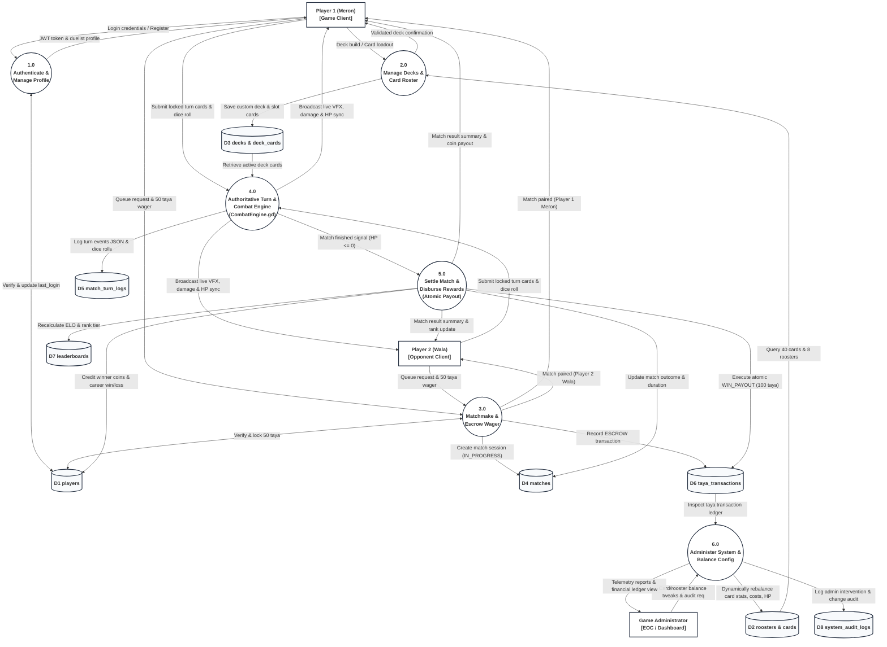

# University of Rizal System
### Cainta Campus
### ITE 8 Information Management
**1st Semester 2026 - 2027**

# Database System Blueprint
### Prototype for the Group Activity

---

## 1. Group Information

| Item | Sample response |
| :--- | :--- |
| **Group name** | The Prototype / Sabong Roosters Dev Team |
| **Members** | KENNETH Q. LOPEZ<br>EMIL O. CARLOTO<br>MYLENE H. ILAGAN<br>MEAGAN NICOLE C. MESA<br>KIERVY O. VIDAD |
| **Proposed system setting** | Online Client-Server Multiplayer Gaming Environment & Campus LAN Tournament Infrastructure (Godot 4 3D Desktop Clients connected to Authoritative Node.js Game Server & MySQL Relational Database) |
| **Target users** | Online Card Game Players / Sabong Duelists, Competitive Tournament Players, System / Database Administrators, Game Operator / Balance Designers |

---

## 2. Original and Improved Title

**Original proposed title:**  
3D Voxel Sabong Card Game

**Improved working title:**  
**Development of an Online Turn-Based 3D Voxel Sabong Card Game Using MySQL Database**

**Why was the title improved?**  
The original proposed title was overly brief and lacked explicit technical definition regarding the game's core gameplay mechanics, aesthetic medium, networking scope, and foundational database architecture. By refining the title to *"Development of an Online Turn-Based 3D Voxel Sabong Card Game Using MySQL Database"*, the scope of the project is made precise and academically rigorous: it specifies that the system is an online multiplayer, turn-based card-battling application utilizing stylized 3D voxel art inspired by Philippine cockfighting culture without animal cruelty, while explicitly highlighting the implementation of a relational MySQL database management system to handle user authentication, rooster statistics, card catalogs, match history auditing, virtual taya currency transactions, and competitive leaderboards.

---

## 3. Problem Statement

Traditional cockfighting (*sabong*) is a deeply rooted cultural pastime in the Philippines, characterized by intricate betting rituals and intense spectator engagement. However, physical cockfighting faces severe ethical controversies regarding animal cruelty, widespread illegal derbies (*tupada*), physical venue hazards, and unregulated monetary risks. While digital adaptations have emerged, they either mirror broadcasted live fights with minimal player agency (such as *e-sabong*) or function as simplistic 2D mobile apps that lack strategic depth, tactical decision-making, and robust data integrity. Furthermore, many existing indie multiplayer card games rely on client-authoritative architectures or uncoordinated local flat files (e.g., local JSON or SQLite files on user machines) that are highly vulnerable to client-side memory manipulation, save-file editing, coin duplication glitches, desynchronization, and lost match histories.

In an online turn-based card game with virtual wagering (*taya* coins), maintaining data consistency, authoritative game-state validation, and auditable financial transactions is critical. Without a centralized, ACID-compliant relational database, players experience concurrency anomalies during simultaneous card submissions, unrecorded match disconnects, unfair card stat manipulation, and untracked currency balances. There is a clear need for a modernized, ethical, and engaging digital alternative: an online turn-based 3D voxel sabong card game where players command stylized anime-parody roosters in simultaneous turn battles, backed by a structured MySQL relational database management system that ensures tamper-proof player authentication, deterministic match logging, atomic taya currency transactions, and trustworthy global rankings.

---

## 4. General Objectives

The online turn-based 3D voxel sabong card game with MySQL database integration is proposed to provide a safe, ethical, strategic, and data-driven digital recreation of traditional cockfighting culture. By transforming cockfighting into an anime-parody tactical card battler with transparent database management, the system delivers rich strategic depth while eliminating physical animal cruelty and ensuring fair, cheat-proof multiplayer competition.

The general objective of this study is to design and develop an online turn-based 3D voxel sabong card game integrated with a relational MySQL database management system that provides synchronized multiplayer card duels, strategic rooster mechanics, persistent player profiles, and ACID-compliant transactional management of match sessions, combat logs, and in-game taya currency.

---

## 5. Specific Objectives

Specifically, the study aims to:

1. **Design and construct an interactive 3D voxel game client using Godot Engine 4**, featuring 8 distinct anime-parody rooster champions (*Chick Yagami, Cluckey D Puffy, Cocktaro, Daniel, Decluck, Eren Pecker, Hen-Goku,* and *Nechicko*), realistic tabletop card physics, 3D dice rolling, and dynamic visual combat VFX.
2. **Implement an authoritative simultaneous turn-based combat engine (`CombatEngine`)** that executes 40 unique cards across 5 functional categories (Attack, Guard, Heal, Damage-over-Time [Poop DoT], and Special Transformations) governed by a 3-Taya energy economy and 1-6 D6 dice roll requirements.
3. **Design, normalize, and implement a relational MySQL database schema** to manage player accounts, champion rosters, card catalogs, player-customized decks, active match sessions, turn-by-turn combat event logs, virtual currency ledgers, and competitive leaderboards.
4. **Develop an authoritative backend application bridge** (Node.js/Express API with connection pooling and JWT session authentication) to securely interface the Godot game client with the MySQL database, ensuring anti-cheat validation and server-authoritative combat resolution.
5. **Engineer an atomic, ACID-compliant transaction ledger for in-game *taya* coins** that records all match entry wagers, round commitments, and victory prize distributions, eliminating race conditions and currency duplication vulnerabilities.
6. **Build an administrative monitoring and game-balancing interface** that enables operators to view live server telemetry, audit taya transaction trails, inspect player matchmaking statistics, and update card/rooster attributes dynamically in the database without client rebuilds.
7. **Evaluate the integrated system** in terms of database query response time, transactional integrity under concurrent multi-user load, network turn synchronization latency, and user gameplay acceptability using ISO/IEC 25010 software quality standards.

---

## 6. System Scope and Limitations

### Included in the Scope
This project encompasses the full design and implementation of an online turn-based 3D voxel card game developed during the academic year 2026-2027. The game client is developed using Godot Engine 4 (GDScript, custom 3D shaders, and high-level ENet multiplayer). The game roster features 8 playable anime-parody rooster champions:
- **Chick Yagami** (*Death Note* parody; DoT master and secret prediction mindgames).
- **Cluckey D Puffy** (*One Piece* parody; tension-building and 5th Gear awakening).
- **Cocktaro** (*JoJo's Bizarre Adventure* parody; Stand counter-attacks and barriers).
- **Daniel** (*Re:Zero* parody; turn-scaling claw/heart and Return by Death revive).
- **Decluck** (*My Hero Academia* parody; variable taya scaling and All For One mode).
- **Eren Pecker** (*Attack on Titan* parody; high-risk self-damaging Titan Stomp and Pecker Titan form).
- **Hen-Goku** (*Dragon Ball* parody; missing-HP scaling and Golden Form transformation).
- **Nechicko** (*Demon Slayer* parody; Demonic Aura stacks and Demon Form).

The card catalog consists of 40 fully realized cards: 8 champion portrait identity cards, 24 rooster signature moves (3 per champion), and 8 shared universal cards (*Chick'n Turd, Claw Slash, Feather Block, Feather Flock, Fried Chicken, Nugget, Poop Burst, T'Claw Slash*). The combat loop operates on a simultaneous turn-resolution model: each round, duelists roll a 3D D6 dice (values 1-6) and receive 3 Taya (energy tokens). Players queue cards from their hand satisfying both the dice threshold and taya cost, locking their turns secretly. The authoritative `CombatEngine` computes the turn across 8 distinct phases: Self-Costs, Transformations, Predictions, Shields, Attacks/Mitigations, Heals, DoT applications/ticks, and Buff decays. Game modes include 1v1 Quick Duel, Casual Bots Tournament against 8 AI opponents, Online Ranked Matchmaking, and a Tutorial Training Ground.

On the persistence layer, the system utilizes a MySQL 8.0 relational database with the InnoDB storage engine. MySQL stores and relates all critical game entities: Users/Players, Rooster Champions, Card Catalogs, Custom Decks, Deck Cards, Match Sessions, Turn Action Logs, Taya Currency Transactions, Seasonal Leaderboards, and System Audit Logs. The backend application layer (Node.js/Express with `mysql2` connection pooling) enforces password hashing via bcrypt, validates JWT session tokens, and executes parameterized SQL queries and ACID transactions to ensure secure, atomic coin updates and cheat-proof match outcomes.

### Outside the Scope
The system does not include real-money gambling, fiat currency deposit/withdrawal systems, or cryptocurrency integrations; all *taya* coins are purely virtual, non-monetary in-game tokens used solely for match wagers and rank progression. The game does not depict real-world animal cruelty, graphic gore, or physical blood; all battles are presented as humorous, stylized 3D voxel anime parody animations. The client is developed and optimized specifically for desktop personal computers (Windows 10/11) and does not include native mobile (iOS/Android) or console ports in this release. Furthermore, the project focuses strictly on session-based 1v1 arena card duels and tournament matchmaking, excluding open-world MMORPG mechanics, player trading economies, or physical peripheral hardware integrations.

---

## 7. Primary Users and Responsibilities

| User type | Responsibilities and permitted activities |
| :--- | :--- |
| **Registered Player / Sabong Duelist** | Registers an account and logs into the game client; selects and previews 3D rooster champions; configures custom decks from universal and signature cards; queues for casual or ranked online duels; rolls round dice; strategizes, queues, and locks turn cards; wagers virtual taya coins; views match results, personal combat history, and global ELO leaderboards. |
| **Game Administrator / System Operator** | Logs into the secure Admin Dashboard to monitor active match sessions and server health; audits virtual taya currency transaction ledgers to detect anomalous betting patterns or exploit attempts; modifies card balance attributes (e.g. taya cost, dice requirement, damage, shield) and rooster base stats in the database; manages user accounts (bans, status changes); inspects system audit logs. |
| **Authoritative Game Server / Matchmaker (System Service)** | An automated backend service that authenticates client JWT tokens; matches queued players based on ELO rating; securely deducts entry taya wagers into escrow; receives secretly submitted turn cards; executes authoritative combat calculations via `CombatEngine`; commits turn event logs to MySQL; settles winner/loser coin payouts atomically; updates seasonal leaderboards. |

---

## 8. Major Data Entities and Attributes

| Data entity | Sample attributes | Purpose |
| :--- | :--- | :--- |
| **Player (`players`)** | `player_id`, `username`, `email`, `password_hash`, `taya_coins`, `total_matches`, `wins`, `losses`, `elo_rating`, `rank_tier`, `created_at`, `last_login`, `status` | Stores registered player accounts, authentication credentials, virtual taya coin balances, cumulative career match statistics, and matchmaking ratings. |
| **Rooster Champion (`roosters`)** | `rooster_id`, `display_name`, `anime_reference`, `base_hp`, `passive_name`, `passive_description`, `model_path`, `dice_model_path`, `theme_color`, `is_unlocked_default` | Stores master catalog definitions of the 8 playable rooster champions, base hit points, unique anime-parody traits, and 3D voxel mesh asset references. |
| **Card Catalog (`cards`)** | `card_id`, `display_name`, `card_type`, `is_universal`, `character_id`, `taya_cost`, `is_variable_cost`, `dice_requirement`, `base_value`, `value_per_taya`, `self_damage`, `usage_gate`, `buff_stat`, `buff_amount`, `buff_duration`, `art_path`, `vfx_type` | Stores the master catalog of all 40 game cards, including their combat archetypes, activation taya costs, dice requirements, damage/shield values, and visual FX keys. |
| **Player Deck (`decks`)** | `deck_id`, `player_id`, `deck_name`, `rooster_id`, `is_active`, `created_at`, `updated_at` | Represents a player's customized card loadout bound to a specific rooster champion for competitive matchmaking. |
| **Deck Card (`deck_cards`)** | `id`, `deck_id`, `card_id`, `slot_index`, `quantity` | Junction entity mapping specific cards from the catalog into a player deck with slot indexing and duplicate limits (e.g. 1 per transformation, 2 per signature move). |
| **Match Session (`matches`)** | `match_id`, `player1_id`, `player2_id`, `p1_rooster_id`, `p2_rooster_id`, `game_mode`, `taya_wager`, `winner_id`, `total_turns`, `match_duration_sec`, `started_at`, `ended_at`, `status` | Records every completed or ongoing match session, participants, chosen champions, wagered coin stakes, match duration, and final outcome. |
| **Match Turn Log (`match_turn_logs`)** | `turn_log_id`, `match_id`, `turn_number`, `p1_dice_roll`, `p2_dice_roll`, `p1_submitted_cards`, `p2_submitted_cards`, `p1_hp_start`, `p2_hp_start`, `p1_hp_end`, `p2_hp_end`, `events_json`, `created_at` | Provides an immutable, turn-by-turn audit log of dice rolls, locked card IDs, damage dealt, shield absorbed, and serialized combat event arrays for match replays. |
| **Taya Transaction (`taya_transactions`)** | `transaction_id`, `player_id`, `match_id`, `transaction_type`, `amount`, `balance_before`, `balance_after`, `timestamp`, `description` | Maintains an ACID-compliant audit ledger of all virtual currency movements (match entry wager escrow, match victory reward, daily login bonus, refund). |
| **Leaderboard Ranking (`leaderboards`)** | `leaderboard_id`, `player_id`, `season_number`, `elo_rating`, `rank_tier`, `wins`, `losses`, `win_rate`, `peak_elo`, `last_calculated` | Stores pre-aggregated competitive leaderboard rankings and tier badges (Grandmaster, Master, Diamond, Platinum, Gold) for high-performance retrieval. |
| **System Audit Log (`system_audit_logs`)** | `log_id`, `admin_id`, `action_type`, `target_entity`, `target_id`, `old_values`, `new_values`, `ip_address`, `timestamp` | Records all administrative changes (e.g. card balance stat tweaks, player account bans, currency adjustments) for governance and security auditing. |

### Entity – Relationship
A **Player** creates one or many **Player Decks**, with each Deck containing multiple **Deck Cards** referencing the master **Card Catalog**. Each Deck is strictly associated with one **Rooster Champion**. In online play, two Players participate in a **Match Session**. A Match Session produces multiple sequential **Match Turn Logs** (one per round played) and generates corresponding **Taya Transactions** for match entry escrow and victory payout. Every Player maintains exactly one seasonal **Leaderboard Ranking** entry that updates upon match completion. Administrative modifications are captured in **System Audit Logs** with foreign references to the acting administrator.

---

## 9. Major System Transactions

| Transaction | User responsible | Expected result |
| :--- | :--- | :--- |
| **Register new player account** | Unregistered User | Validates unique username and email format; hashes password with bcrypt; creates a new Player record initialized with 500 starting Taya coins, 1000 base ELO rating, and creates default starter decks. |
| **Authenticate player login** | Player | Verifies username and password hash; generates a cryptographically signed JWT session token; updates `last_login` timestamp; returns player profile, coin balance, and active deck data. |
| **Retrieve champion & card catalog** | Player / Client | Queries the database for all 8 Rooster Champions and 40 Cards; caches definitions locally in Godot for responsive UI rendering and character select display. |
| **Save / customize player deck** | Player | Validates deck constraints (exact card count, valid rooster signature moves, max copies); inserts or updates Deck and Deck_Card records; marks the deck as active. |
| **Queue for matchmaking & escrow taya** | Player | Player selects wager amount (e.g. 50 taya); system verifies balance; deducts wager and creates an ESCROW Taya_Transaction; places player in ranked matchmaking queue. |
| **Initialize match session** | Game Server (automated) | Matches two queued players; creates a new Match record in PENDING status; assigns Player 1 (Meron) and Player 2 (Wala); syncs duelist data to both clients. |
| **Roll round dice & replenish energy** | Game Server (automated) | At round start, generates authoritative server-side D6 dice rolls (1-6) for both duelists; resets available Taya energy to 3; broadcasts roll to clients for 3D dice rendering. |
| **Submit locked turn cards** | Player | Player selects cards satisfying dice requirements and taya cost; client securely sends card IDs to server; server locks turn submission and sets status to READY. |
| **Execute authoritative combat resolution** | Game Server (automated) | Once both turns lock, server invokes `CombatEngine`; resolves self-damage, transformations, predictions, shields, attacks, heals, and DoTs; evaluates remaining HPs; records a new Match_Turn_Log entry with full event JSON; broadcasts events for client 3D playback. |
| **Conclude match & disburse taya prize** | Game Server (automated) | Detects knockout (HP <= 0); updates Match record with winner_id, end timestamp, and FINISHED status; initiates an atomic database transaction that disburses the escrowed prize pool (e.g. 100 taya) to the winner and records WIN_PAYOUT Taya_Transaction. |
| **Update ELO ratings & leaderboard** | Game Server (automated) | Calculates updated ELO rating using standard competitive rating formulas; updates Player career stats (total_matches, wins, losses); updates Leaderboard ranking entry and tier badge. |
| **Query match history & combat replay** | Player | Retrieves paginated historical matches, opponent usernames, rooster choices, and turn-by-turn logs for post-match analysis. |
| **Update card / rooster balance parameters** | Game Administrator | Modifies card damage, taya cost, dice requirement, or rooster base HP in the database; changes immediately take effect for all subsequent matches without requiring client binary patches. |
| **Audit currency transactions & inspect logs** | Game Administrator | Filters and reviews Taya_Transactions and System_Audit_Logs to verify financial ledger balance, detect fraudulent activity, or investigate player dispute tickets. |

---

## 10. Required DBMS Functions and Their Application

| DBMS function or concern | Application in the proposed system |
| :--- | :--- |
| **Data storage and organization** | Player credentials, 8 rooster champion definitions, 40 card mechanics, customized player decks, live match sessions, round-by-round combat logs, virtual taya ledgers, and leaderboards are stored across 10 structured, normalized relational tables in MySQL (InnoDB engine) rather than fragmented local text or JSON files. |
| **Data retrieval and querying** | The game client and server retrieve catalog data, active player decks, current coin balances, and live opponent profiles using indexed SELECT queries. The leaderboard interface executes optimized `ORDER BY elo_rating DESC` queries with LIMIT/OFFSET pagination to display top sabong champions with sub-50ms latency. |
| **Data insertion and updating** | New user accounts are inserted on registration. On every combat round, an authoritative Match_Turn_Log entry containing dice rolls, card choices, and event payloads is inserted. At match conclusion, winner/loser records and ELO ratings are updated synchronously. |
| **Data validation** | Database constraints enforce business rules: player emails and usernames are `UNIQUE`; taya coin balances cannot be negative (`CHECK (taya_coins >= 0)`); dice requirements are constrained between 1 and 6; card types are restricted to `ATTACK`, `GUARD`, `HEAL`, `DOT`, `SPECIAL` via ENUM types. |
| **Security and user access** | Passwords are never stored in plaintext; they are hashed using bcrypt with salt. Access to database endpoints requires a cryptographically signed JWT token. Database user privileges follow the principle of least privilege: the game server uses a restricted MySQL account with DML permissions (`SELECT`, `INSERT`, `UPDATE`), while administrative schema modifications are isolated to privileged admin connections. |
| **Data integrity** | Referential integrity is strictly enforced via foreign key constraints. Deleting a test deck cascades deletions to linked `deck_cards` (`ON DELETE CASCADE`), while deleting a player retains historic match records with foreign keys safely handled (`ON DELETE RESTRICT` or `SET NULL`) to preserve immutable match auditability. |
| **Backup and recovery** | The MySQL database executes automated daily `mysqldump` backups and retains binary logs (binlogs) for point-in-time recovery (PITR). In the event of hardware failure or accidental data corruption, transactions can be restored to the exact second prior to the incident. |
| **Multi-user access** | The system handles simultaneous concurrent duels and matchmaking requests using MySQL connection pooling (via `mysql2` pool in the Node.js backend) and InnoDB row-level locking. Atomic transactions (`START TRANSACTION ... COMMIT`) prevent race conditions when two players wager coins simultaneously. |
| **Reporting** | The database supports analytical queries generating game balance reports (e.g. champion win-rate distributions, card pick-rates across 40 cards, average match duration, daily active duelists, and taya coin circulation volume) accessible from the Admin Command Center. |
| **Auditability** | All virtual taya currency deductions and payouts are logged in the immutable `taya_transactions` table with before/after balance snapshots. Administrative interventions (card stat balancing, account bans) are logged in `system_audit_logs` with admin ID, action codes, previous and modified values, and timestamps. |

---

## 11. Proposed DBMS Architecture

### Selected Architecture: Three-tier Client-Server Architecture
The development team selected a three-tier client-server architecture because an online competitive multiplayer card game requires strict separation between the user presentation, game business logic, and persistent database storage. Direct database access from game clients is prohibited as it would expose database credentials, invite SQL injection, and allow malicious players to alter health, dice rolls, or coin balances via memory hacking. Separating the system into Presentation, Application, and Database tiers enforces authoritative validation, isolates database secrets, and guarantees fair play.

### Architecture Diagram

#### Level-1 Data Flow Diagram (DFD)




#### Client-Server System Architecture Diagram

```
+---------------------------------------------------------------------------------+
|                             PRESENTATION LAYER (CLIENT)                         |
|  - Godot Engine 4 (Desktop Windows Client / GDScript)                           |
|  - 3D Voxel Arenas, Tabletop Card Physics (Card3D), Dice Roller (DiceRoller3D)  |
|  - UI Interfaces: MainMenu, CharacterSelect, MatchUI, LeaderboardModal         |
+---------------------------------------+-----------------------------------------+
                                        | HTTPS / Secure WebSockets (JSON / RPC)
                                        v
+---------------------------------------------------------------------------------+
|                            APPLICATION LAYER (LOGIC SERVER)                     |
|  - Node.js & Express.js Game API Server (or Authoritative Godot Dedicated Host) |
|  - JWT Authentication Middleware & Bcrypt Password Verifier                     |
|  - Matchmaking Service & Turn Timer Synchronizer                               |
|  - Authoritative CombatEngine: Multi-Phase Simultaneous Combat Arbiter          |
|  - Connection Pool Manager (mysql2 with connection pooling & transaction guard) |
+---------------------------------------+-----------------------------------------+
                                        | TCP Port 3306 (SSL / Parameterized SQL)
                                        v
+---------------------------------------------------------------------------------+
|                              DATABASE LAYER (PERSISTENCE)                       |
|  - MySQL 8.0 Community Server (InnoDB Storage Engine)                           |
|  - Relational Schema: Players, Roosters, Cards, Decks, Matches, Turn Logs,      |
|                       Taya Transactions, Leaderboards, System Audit Logs        |
|  - ACID Transaction Management (START TRANSACTION, COMMIT, ROLLBACK)            |
|  - Automated Daily Backup Service & Binary Logging (binlog for PITR)            |
+---------------------------------------------------------------------------------+
```

### Architecture Justification
This three-tier architecture is ideally suited for the Online Turn-Based 3D Voxel Sabong Card Game for several technical reasons. In the Presentation Layer, players interact solely with the Godot 4 client, which handles 3D rendering, voxel mesh animations, audio, and player inputs without possessing any direct connection to the MySQL database. When a player logs in, builds a deck, or commits turn cards, the client transmits authenticated JSON payloads over HTTPS or secure WebSockets to the Application Layer. The Application Layer verifies the player's JWT token, enforces anti-cheat rules, conducts matchmaking, and executes the authoritative `CombatEngine` so that turn outcomes cannot be tampered with on the client machine. The Application Layer then interfaces with the Database Layer using pooled, SSL-encrypted MySQL connections executing parameterized SQL statements and atomic transactions. This guarantees that database credentials remain strictly confidential on the server, prevents SQL injection, and ensures that critical taya coin transfers and match logs remain consistent and ACID-compliant under heavy concurrent player traffic.

---

## 12. Feasibility, Risks, and Proposed Solutions

| Risk or limitation | Possible effect | Proposed response |
| :--- | :--- | :--- |
| **Player disconnects or rage-quits mid-match** | The active match session freezes, leaving the connected opponent stuck waiting indefinitely on the turn resolution screen. | The server implements a 30-second turn countdown timer. If a disconnected player fails to reconnect within the window, the server automatically forfeits the match, assigns victory to the active duelist, settles taya escrow, and logs the forfeit in `match_turn_logs`. |
| **Concurrent taya coin updates (race conditions)** | Simultaneous match entry or rapid clicking could cause a player's taya balance to be debited twice or produce negative coin balances (double-spending). | All balance modifications are executed inside ACID transactions using `SELECT ... FOR UPDATE` row-level locks and database-level `CHECK (taya_coins >= 0)` constraints, ensuring atomic serial updates. |
| **MySQL database server connection timeout or crash** | Match sessions fail to record, player profile logins fail, and leaderboard updates halt during database downtime. | The backend utilizes `mysql2` connection pooling with auto-reconnection and exponential backoff retry logic. Live combat runs in-memory on the game server; if the database temporarily disconnects, completed match logs are cached in a durable local queue and flushed upon reconnection. |
| **Malicious client-side memory tampering / cheat injection** | Cheaters manipulate local memory values to grant infinite taya energy, bypass dice roll requirements, or alter card damage. | The game enforces a strictly server-authoritative architecture. The client only sends card IDs. The server validates that the player owns the cards, has sufficient taya, rolled the required dice face, and calculates all damage and healing server-side via `CombatEngine`. |
| **High concurrent database write load during tournament rushes** | Heavy disk I/O from simultaneous turn-log insertions could cause slow query response times and increased network ping. | The database optimizes write throughput using InnoDB buffer pools, batched turn-log commits, asynchronous logging queues, and secondary indexes targeted specifically on frequently queried foreign keys (`match_id`, `player_id`). |
| **Card / Champion balance exploits (overpowered meta)** | Certain card combinations (e.g. stacking unlimited Demonic Aura or Daniel revives) dominate matches, causing player dissatisfaction and game meta stagnation. | Card attributes, taya costs, dice requirements, and champion base HP are stored in the MySQL master catalog rather than hardcoded in the client. Administrators can adjust parameters directly in the database to rebalance gameplay instantly without requiring client binary updates. |
| **Unauthorized administrative access to database** | An attacker gaining administrative privileges could artificially inject taya coins, alter win records, or view player hashes. | The admin portal is protected by multi-factor authentication, IP whitelisting, and strict JWT role validation (`role = 'ADMIN'`). Every administrative update automatically writes an unalterable record to `system_audit_logs`. |

---

## 13. Preliminary Feasibility Assessment

| Feasibility area | Assessment |
| :--- | :--- |
| **Technical feasibility** | The system is built on mature, industry-standard technologies: Godot Engine 4 (GDScript, ENet multiplayer, 3D voxel rendering), Node.js/Express.js (asynchronous I/O backend), and MySQL 8.0 (ACID-compliant relational database with InnoDB). The team has already implemented the 3D tabletop card interaction, the 8 anime-parody champions, the 40-card moveset, and the authoritative multi-phase `CombatEngine`. The database integration relies on established SQL connection pooling and REST/WebSocket protocols. |
| **Operational feasibility** | The game addresses the cultural appeal of Philippine sabong while eliminating ethical animal welfare issues through stylized voxel parody art. The user interface provides intuitive card clicking, 3D dice rolling, clear taya energy counters, and transparent combat event logs. The admin dashboard is tailored for operators with clear tabular navigation for account and balance management. |
| **Schedule feasibility** | The development timeline is structured across the academic semester: Core 3D engine, card physics, and combat arbiter (Phase 1); MySQL database schema design, normalization, and backend API integration (Phase 2); Online matchmaking, turn logging, and taya ledger implementation (Phase 3); Performance testing, balancing, and ISO/IEC 25010 evaluation (Phase 4). The current functional state confirms project milestones are achievable within schedule. |
| **Data and privacy feasibility** | The system collects only minimal player information: a unique username, an email address, and an encrypted password hash. No real-world financial data, credit card numbers, or sensitive personal identification are processed, as all wagering is conducted via in-game virtual tokens. User data handling adheres to the Philippine Data Privacy Act of 2012 (Republic Act No. 10173), with passwords protected by bcrypt hashing and secure session tokens. |

---

## 14. User Requirement

> **User Story:**  
> *"As a Competitive Sabong Duelist, I want to queue for an online ranked match, select my custom rooster deck, wager virtual taya coins, and execute tactical card plays in a synchronized 3D arena so that I can defeat opponents, earn taya coin payouts, and climb the global cockpit leaderboard in a fair, cheat-proof environment."*

### Acceptance Conditions
The requirement is considered satisfied when the player can successfully authenticate via username and password, view their current taya coin balance, and select a customized deck bound to an unlocked rooster champion. Upon initiating ranked matchmaking, the system must verify sufficient balance, deduct the designated entry wager (e.g. 50 taya) into escrow, and pair the player with a matched opponent. During each round, the game must roll an authoritative 3D D6 dice and grant 3 Taya energy. The player must be able to select and lock cards satisfying the roll and cost. Once both players lock, the server must compute the combat resolution via `CombatEngine`, record the turn log in MySQL, and stream visual events to both clients. Upon reducing the opponent's HP to zero, the match must conclude by marking the winner, transferring the 100 taya prize pool to the winner's account via an atomic transaction, updating career stats, and reflecting the revised ELO rating on the global leaderboard.

---

## 15. Data Flow Scenario

A registered player opens the Sabong Roosters client and submits their login credentials from the MainMenu. The client dispatches an HTTPS POST request to the backend auth endpoint. The server validates the credentials against the Players table using bcrypt, generates a signed JWT session token, and returns the player's profile, taya coin balance, and active custom deck. The player transitions to the Mode Selection screen and chooses **TOURNAMENT (Online Matchmaking)**. The client transmits a matchmaking request specifying a 50-taya wager. The backend initiates an atomic database transaction that locks the player's account row, verifies a balance of at least 50 coins, deducts 50 taya, and inserts an ESCROW transaction record into the `taya_transactions` table.

Once a suitable opponent is paired, the matchmaker creates a new record in the `matches` table with status `'IN_PROGRESS'`, assigns the two duelists as Player 1 (Meron) and Player 2 (Wala), and initializes the 3D Arena. At the start of Round 1, the server generates cryptographic random dice rolls (e.g., P1 rolls 4, P2 rolls 2) and allocates 3 Taya energy tokens to each duelist, transmitting the seed to the Godot clients to drive the 3D rigid-body dice animation. Both players inspect their drawn cards lying on the 3D table. Player 1 queues *'Kame-cock'* (Hen-Goku signature attack, cost 2 taya, dice req 2+) and *'Ki-kiri-ki Barrier'* (shield, cost 1 taya, dice req 1+), spending all 3 taya, and clicks the Ring Bell / End Turn button. The client encrypts and transmits the submitted card IDs to the server over WebSocket.

When both players have locked their submissions, the authoritative server executes `CombatEngine.resolve_turn()`. The engine sequentially processes self-costs, stance transformations, secret predictions, shields, attacks with damage mitigation, heals, and poop DoT ticks. The server compiles the resulting combat events, writes a detailed record to `match_turn_logs` containing start/end HPs and serialized event JSON, and broadcasts the event sequence to both clients. The Godot clients execute synchronized animations: cards lift, projectile beams fire, floating damage numbers appear, and HP bars update. If Player 2's HP drops to 0, the server triggers match termination: it updates the `matches` record with the `winner_id` and end timestamp, executes an atomic transaction transferring the 100 taya prize pool to Player 1's balance while recording a `WIN_PAYOUT` transaction, recomputes both players' ELO ratings, and updates the `leaderboards` table. Both players receive a match summary modal displaying updated coins and leaderboard standings, successfully completing the data flow scenario.

---

## References

1. Date, C. J. (2019). *Database Design and Relational Theory: Normal Forms and All That Jazz* (2nd ed.). O'Reilly Media.
2. Elmasri, R., & Navathe, S. B. (2016). *Fundamentals of Database Systems* (7th ed.). Pearson.
3. Godot Engine Documentation. (2024). *High-level multiplayer and 3D physics in Godot 4*. https://docs.godotengine.org/
4. ISO/IEC. (2011). *Systems and software engineering — Systems and software Quality Requirements and Evaluation (SQuaRE) — System and software quality models* (ISO/IEC Standard No. 25010:2011). International Organization for Standardization.
5. MySQL Documentation Team. (2024). *MySQL 8.0 Reference Manual: The InnoDB Storage Engine and ACID Model*. Oracle Corporation. https://dev.mysql.com/doc/refman/8.0/en/
6. Republic of the Philippines. (2012). *Data Privacy Act of 2012* (Republic Act No. 10173). Official Gazette of the Republic of the Philippines.
7. Sethi, A., & Khullar, V. (2021). *Comparative study of relational database transactions and concurrency control in multi-tier online gaming platforms*. Journal of King Saud University – Computer and Information Sciences, 33(7), 812-824.
8. Sylvester, T. (2013). *Designing Games: A Guide to Engineering Experiences*. O'Reilly Media.

---

## Appendix: Complete MySQL Relational Schema (DDL)

To support seamless database setup and testing in MySQL or tools such as dbdiagram.io / phpMyAdmin, the complete DDL schema is provided below:

```sql
-- =============================================================================
-- MySQL Relational Schema for Sabong Roosters
-- Online Turn-Based 3D Voxel Sabong Card Game
-- Database Engine: MySQL 8.0+ (InnoDB)
-- =============================================================================

CREATE DATABASE IF NOT EXISTS sabong_roosters_db
CHARACTER SET utf8mb4 COLLATE utf8mb4_unicode_ci;

USE sabong_roosters_db;

-- 1. Players Table
CREATE TABLE IF NOT EXISTS players (
    player_id INT AUTO_INCREMENT PRIMARY KEY,
    username VARCHAR(50) NOT NULL UNIQUE,
    email VARCHAR(100) NOT NULL UNIQUE,
    password_hash VARCHAR(255) NOT NULL,
    taya_coins INT UNSIGNED NOT NULL DEFAULT 500,
    total_matches INT UNSIGNED NOT NULL DEFAULT 0,
    wins INT UNSIGNED NOT NULL DEFAULT 0,
    losses INT UNSIGNED NOT NULL DEFAULT 0,
    elo_rating INT NOT NULL DEFAULT 1000,
    rank_tier ENUM('BRONZE', 'SILVER', 'GOLD', 'PLATINUM', 'DIAMOND', 'MASTER', 'GRANDMASTER') NOT NULL DEFAULT 'BRONZE',
    status ENUM('ACTIVE', 'SUSPENDED', 'BANNED') NOT NULL DEFAULT 'ACTIVE',
    created_at TIMESTAMP DEFAULT CURRENT_TIMESTAMP,
    last_login TIMESTAMP NULL DEFAULT NULL,
    INDEX idx_players_elo (elo_rating DESC),
    INDEX idx_players_username (username)
) ENGINE=InnoDB;

-- 2. Rooster Champions Catalog
CREATE TABLE IF NOT EXISTS roosters (
    rooster_id VARCHAR(32) PRIMARY KEY,
    display_name VARCHAR(64) NOT NULL,
    anime_reference VARCHAR(100) NOT NULL,
    base_hp INT UNSIGNED NOT NULL DEFAULT 20,
    passive_name VARCHAR(64) NOT NULL,
    passive_description TEXT NOT NULL,
    model_path VARCHAR(255) NOT NULL,
    dice_model_path VARCHAR(255) NULL,
    theme_color VARCHAR(16) NOT NULL DEFAULT '#FF4D4D',
    is_unlocked_default BOOLEAN NOT NULL DEFAULT TRUE
) ENGINE=InnoDB;

-- 3. Card Catalog
CREATE TABLE IF NOT EXISTS cards (
    card_id VARCHAR(64) PRIMARY KEY,
    display_name VARCHAR(64) NOT NULL,
    card_type ENUM('ATTACK', 'GUARD', 'HEAL', 'DOT', 'SPECIAL') NOT NULL,
    is_universal BOOLEAN NOT NULL DEFAULT FALSE,
    character_id VARCHAR(32) NULL,
    taya_cost TINYINT UNSIGNED NOT NULL DEFAULT 1,
    is_variable_cost BOOLEAN NOT NULL DEFAULT FALSE,
    dice_requirement TINYINT UNSIGNED NOT NULL DEFAULT 1,
    base_value INT NOT NULL DEFAULT 0,
    value_per_taya INT NOT NULL DEFAULT 0,
    self_damage INT UNSIGNED NOT NULL DEFAULT 0,
    usage_gate ENUM('ALWAYS', 'STATE_LOCKED', 'ONCE_PER_MATCH', 'REACTIVE') NOT NULL DEFAULT 'ALWAYS',
    buff_stat VARCHAR(32) NULL,
    buff_amount INT NOT NULL DEFAULT 0,
    buff_duration TINYINT UNSIGNED NOT NULL DEFAULT 0,
    art_path VARCHAR(255) NOT NULL,
    vfx_type VARCHAR(32) NULL,
    FOREIGN KEY (character_id) REFERENCES roosters(rooster_id) ON DELETE SET NULL
) ENGINE=InnoDB;

-- 4. Player Custom Decks
CREATE TABLE IF NOT EXISTS decks (
    deck_id INT AUTO_INCREMENT PRIMARY KEY,
    player_id INT NOT NULL,
    deck_name VARCHAR(64) NOT NULL DEFAULT 'Custom Deck',
    rooster_id VARCHAR(32) NOT NULL,
    is_active BOOLEAN NOT NULL DEFAULT FALSE,
    created_at TIMESTAMP DEFAULT CURRENT_TIMESTAMP,
    updated_at TIMESTAMP DEFAULT CURRENT_TIMESTAMP ON UPDATE CURRENT_TIMESTAMP,
    FOREIGN KEY (player_id) REFERENCES players(player_id) ON DELETE CASCADE,
    FOREIGN KEY (rooster_id) REFERENCES roosters(rooster_id) ON DELETE RESTRICT
) ENGINE=InnoDB;

-- 5. Deck Cards Junction
CREATE TABLE IF NOT EXISTS deck_cards (
    id INT AUTO_INCREMENT PRIMARY KEY,
    deck_id INT NOT NULL,
    card_id VARCHAR(64) NOT NULL,
    slot_index TINYINT UNSIGNED NOT NULL,
    quantity TINYINT UNSIGNED NOT NULL DEFAULT 1,
    FOREIGN KEY (deck_id) REFERENCES decks(deck_id) ON DELETE CASCADE,
    FOREIGN KEY (card_id) REFERENCES cards(card_id) ON DELETE RESTRICT,
    UNIQUE KEY uq_deck_slot (deck_id, slot_index)
) ENGINE=InnoDB;

-- 6. Match Sessions
CREATE TABLE IF NOT EXISTS matches (
    match_id INT AUTO_INCREMENT PRIMARY KEY,
    player1_id INT NOT NULL,
    player2_id INT NOT NULL,
    p1_rooster_id VARCHAR(32) NOT NULL,
    p2_rooster_id VARCHAR(32) NOT NULL,
    game_mode ENUM('VERSUS_1V1', 'CASUAL_BOTS', 'TOURNAMENT_ONLINE', 'TUTORIAL') NOT NULL DEFAULT 'TOURNAMENT_ONLINE',
    taya_wager INT UNSIGNED NOT NULL DEFAULT 0,
    winner_id INT NULL,
    total_turns INT UNSIGNED NOT NULL DEFAULT 0,
    match_duration_sec INT UNSIGNED NOT NULL DEFAULT 0,
    status ENUM('PENDING', 'IN_PROGRESS', 'FINISHED', 'FORFEITED', 'CANCELLED') NOT NULL DEFAULT 'PENDING',
    started_at TIMESTAMP DEFAULT CURRENT_TIMESTAMP,
    ended_at TIMESTAMP NULL DEFAULT NULL,
    FOREIGN KEY (player1_id) REFERENCES players(player_id) ON DELETE RESTRICT,
    FOREIGN KEY (player2_id) REFERENCES players(player_id) ON DELETE RESTRICT,
    FOREIGN KEY (p1_rooster_id) REFERENCES roosters(rooster_id) ON DELETE RESTRICT,
    FOREIGN KEY (p2_rooster_id) REFERENCES roosters(rooster_id) ON DELETE RESTRICT,
    FOREIGN KEY (winner_id) REFERENCES players(player_id) ON DELETE SET NULL,
    INDEX idx_matches_p1 (player1_id),
    INDEX idx_matches_p2 (player2_id),
    INDEX idx_matches_status (status)
) ENGINE=InnoDB;

-- 7. Match Turn Logs
CREATE TABLE IF NOT EXISTS match_turn_logs (
    turn_log_id BIGINT AUTO_INCREMENT PRIMARY KEY,
    match_id INT NOT NULL,
    turn_number INT UNSIGNED NOT NULL,
    p1_dice_roll TINYINT UNSIGNED NOT NULL,
    p2_dice_roll TINYINT UNSIGNED NOT NULL,
    p1_submitted_cards JSON NOT NULL,
    p2_submitted_cards JSON NOT NULL,
    p1_hp_start INT NOT NULL,
    p2_hp_start INT NOT NULL,
    p1_hp_end INT NOT NULL,
    p2_hp_end INT NOT NULL,
    events_json JSON NOT NULL,
    created_at TIMESTAMP DEFAULT CURRENT_TIMESTAMP,
    FOREIGN KEY (match_id) REFERENCES matches(match_id) ON DELETE CASCADE,
    INDEX idx_turn_logs_match (match_id, turn_number)
) ENGINE=InnoDB;

-- 8. Taya Currency Transaction Ledger
CREATE TABLE IF NOT EXISTS taya_transactions (
    transaction_id BIGINT AUTO_INCREMENT PRIMARY KEY,
    player_id INT NOT NULL,
    match_id INT NULL,
    transaction_type ENUM('MATCH_WAGER_ESCROW', 'WIN_PAYOUT', 'REFUND', 'DAILY_LOGIN', 'ADMIN_ADJUSTMENT') NOT NULL,
    amount INT NOT NULL,
    balance_before INT UNSIGNED NOT NULL,
    balance_after INT UNSIGNED NOT NULL,
    timestamp TIMESTAMP DEFAULT CURRENT_TIMESTAMP,
    description VARCHAR(255) NULL,
    FOREIGN KEY (player_id) REFERENCES players(player_id) ON DELETE RESTRICT,
    FOREIGN KEY (match_id) REFERENCES matches(match_id) ON DELETE SET NULL,
    INDEX idx_trans_player (player_id, timestamp DESC)
) ENGINE=InnoDB;

-- 9. Competitive Leaderboards
CREATE TABLE IF NOT EXISTS leaderboards (
    leaderboard_id INT AUTO_INCREMENT PRIMARY KEY,
    player_id INT NOT NULL UNIQUE,
    season_number INT UNSIGNED NOT NULL DEFAULT 1,
    elo_rating INT NOT NULL DEFAULT 1000,
    rank_tier ENUM('BRONZE', 'SILVER', 'GOLD', 'PLATINUM', 'DIAMOND', 'MASTER', 'GRANDMASTER') NOT NULL DEFAULT 'BRONZE',
    wins INT UNSIGNED NOT NULL DEFAULT 0,
    losses INT UNSIGNED NOT NULL DEFAULT 0,
    win_rate DECIMAL(5, 2) GENERATED ALWAYS AS (
        CASE WHEN (wins + losses) > 0 THEN (wins / (wins + losses)) * 100 ELSE 0.00 END
    ) STORED,
    peak_elo INT NOT NULL DEFAULT 1000,
    last_calculated TIMESTAMP DEFAULT CURRENT_TIMESTAMP ON UPDATE CURRENT_TIMESTAMP,
    FOREIGN KEY (player_id) REFERENCES players(player_id) ON DELETE CASCADE,
    INDEX idx_leaderboard_rank (season_number, elo_rating DESC)
) ENGINE=InnoDB;

-- 10. System Audit Logs
CREATE TABLE IF NOT EXISTS system_audit_logs (
    log_id BIGINT AUTO_INCREMENT PRIMARY KEY,
    admin_id INT NULL,
    action_type VARCHAR(64) NOT NULL,
    target_entity VARCHAR(64) NOT NULL,
    target_id VARCHAR(64) NOT NULL,
    old_values JSON NULL,
    new_values JSON NULL,
    ip_address VARCHAR(45) NULL,
    timestamp TIMESTAMP DEFAULT CURRENT_TIMESTAMP,
    INDEX idx_audit_timestamp (timestamp DESC)
) ENGINE=InnoDB;
```
